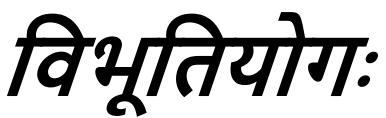

## *CHAPTER 10 THE DIVINE GLORY*

In the seventh chapter, as also in the ninth, have been revealed the reality [\(1\)](#page--1-0) and the glories [\(2\)](#page--1-1) of the Bhagavān. Thereafter, now have to be presented those manifestations through which the Bhagavān is to be meditated on. And the reality of the Bhagavān also, though spoken of earlier, has to be repeated because of its inscrutability. Hence—

*Shri Hari said:*

## भूय एव महाबाहो शृणु मे परमं वच:। येऽहं ीयमाणाय वयािम िहतकायया॥१॥

1. O mighty-armed one, listen over again to My supreme utterance, which I, wishing your welfare, shall speak to you who take delight (in it).

O mighty-armed one, *śrnu*, listen; *bhūyah eva*, over again; *me*, to My; *paramam*, supreme; *vacah*, utterance, which is expressive of the transcendental Reality; *yat*, which supreme Truth; *aham*, I; *vaksyāmi*, shall speak; *te*, to you; *prīyamānāya*, who take delight (in it). You become greatly pleased by My utterance, like one drinking ambrosia. Hence, I shall speak to you *hita-kāmyayā*, wishing your welfare.

'Why shall I speak?' In answer to this the Bhagavān says:

## न मे िवद: ु सुरगणा: भवं न महषय:।

े