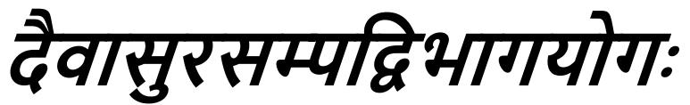

## *CHAPTER 16*

## *THE DIVINE AND THE DEMONIACAL ATTRIBUTES*

The divine, fiendish and demoniacal natures of creatures were referred to in the ninth chapter (12, 13). In order to present them elaborately, the chapter opening with 'Fearlessness, purity of the mind,' etc. is begun. Among them, the divine nature leads to Liberation from worldly existence, while the fiendish and demoniacal lead to bondage. Hence, the divine nature is being presented so that it may be accepted, and the other two rejected.

*Shri Hari said:*

## अभयं सवसंशुिनयोगयविथित:। दानं दम य वायायतप आजवम्॥१॥

1. Shri Hari said—Fearlessness, purity of mind, persistence in knowledge and Yog, charity and control of the external organs, sacrifice, (scriptural) study, austerity and rectitude;

*Abhayam*, fearlessness; *sattva-saṁśuddhih*, purity of the mind (*sattva*), mentally avoiding fraud, trickery, falsehood, etc. in dealings, that is, honest behaviour; *jñāna-Yog-vyavasthitih*, persistence in knowledge and Yog—*jñāna* means knowledge of such subjects as the Self, learnt from scriptures and teachers; *Yog* means making those things that have been learnt matters of one's own personal