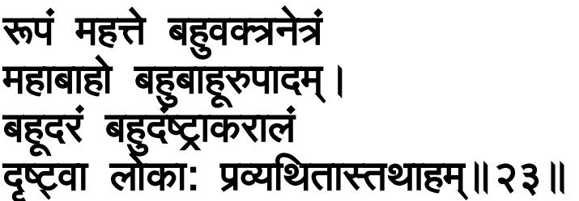

and others—, demons—Virocana and others—, and Siddhas— Kapila and others; *sarve eva*, all of those very ones; *vīksante*, gaze; *tvā*, (that is) *tvām*, at You; *vismitāh eva*, being indeed struck with wonder.

For,

23. O mighty-armed One, seeing Your immense form with many mouths and eyes, having numerous arms, thighs and feet, with many bellies, and fearful with many teeth, the creatures are struck with terror, and so am I.

*Mahābāho*, O mighty-armed One; *drsṭvā*, seeing; *te*, Your; *mahat*, immense, very vast; *rūpam*, form of this kind; *bahu-vaktra-netram*, with many mouths and eyes; *bahu-bāhu-ūru-pādam*, having many arms, thighs and feet; and further, *bahu-udaram*, with many bellies; and *bahu-daṁsṭrā-karālam*, fearful with many teeth; *lokāh*, the creatures in the world; are *pravyathitāh*, struck with terror; *tathā*, and so also; am even *aham*, I.

The reason of that is this:

नभ:पृशं दीतमनकव े णं यााननं दीतिवशालने म्। द ृ वा िह व यिथतातरामा धृितं न िवदािम शमं च िवणो॥२४॥

24. O Visnu, verily, seeing Your form touching heaven, blazing, with many colours, open-mouthed, with fiery large eyes, I, becoming terrified in my mind, do not find steadiness and peace.

O Visnu, *hi*, verily; *drsṭvā*, seeing; *tvām*, You; *nabhah-sprśam*, touching heaven; *dīptam*, blazing; *aneka-varnam*, with many colours,