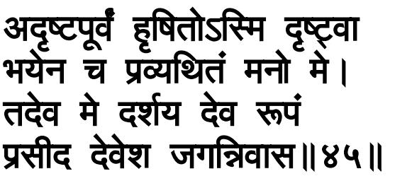

and as a *sakhā*, friend; the faults *sakhyuh*, of a friend; or as a *priyah*, lover; forgives the faults *priyāyāh*, of a beloved.

45. I am delighted by seeing something not seen heretofore, and my mind is stricken with fear. O Bhagavān, show me that very form; O supreme Bhagavān, O Abode of the Universe, be gracious!

*Asmi*, I am; *hrsitah*, delighted; *drsṭvā*, by seeing; *adrsṭa-pūrvam*, something not seen heretofore—by seeing this Cosmic form of Yours which has never been seen before by me or others. And *me*, my; *manah*, mind; is *pravyathitam*, stricken; *bhayena*, with fear. Therefore, *deva*, O Bhagavān; *darśaya*, show; *me*, to me; *tat eva*, that very; *rūpam*, form, which is of my friend. *Deveśa*, O supreme Bhagavān; *jagan-nivāsa*, Abode of the Universe; *prasīda*, be gracious!

## िकरीिटनं गिदनं चहत- िमछािम व ुमहं तथैव। तेनवै पेण चतुभु जेन सहबाहो भव िवमूत॥४६॥

46. I want to see You just as before, wearing a crown, wielding a mace, and holding a disc in hand. O You with thousand arms, O You of Cosmic form, appear with that very form with four hands.

*Aham*, I; *icchāmi*, want; *drasṭum*, to see; *tvām*, You; *kirīṭinam*, wearing a crown; as also *gadinam*, wielding a mace; and *cakrahastam*, holding a disc in hand; that is, *tathā eva*, just as before. Since this is so, therefore, *sahasra-bāho*, O You with a thousand arms—in Your present Cosmic form; *viśva-mūrte*, O You of Cosmic form; *bhava*, appear; *tena eva rūpena*, with that very form—with the