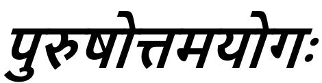

## *CHAPTER 15 THE SUPREME PERSON*

'Since the result of actions of those who perform their rites and duties and the result of those who tread the path of Knowledge are at My disposal, therefore those who worship Me through the Yog of Devotion, they, having transcended the qualities through the stages leading to Illumination, attain Liberation by My grace.' It goes without saying that those who fully know the reality of the Self itself attain it (Liberation). Hence, though not asked by Arjuna, the Bhagavān said, 'With roots above,' etc., with the intention of speaking about the reality of the Self.

Now then, for the sake of arousing dispassion He first describes the real nature of the world through the imagery of a tree; because of the competence for the knowledge of the nature of Bhagavān is only his who has become detached from the world; not of any other. Hence, —

*Shri Hari said:*

## ऊवमूलमध:शाखमथं ाहर ु ययम्। छदिस यय पणिन यतं वेद स वेदिवत्॥१॥

1. They say that the Peepul Tree, which has its roots upward and the branches downward, and of which the Vedas are the leaves, is imperishable. He who realizes it is knower of the Vedas.