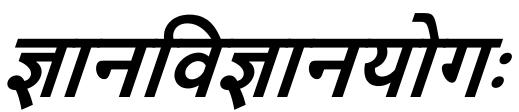

## *CHAPTER 7 JÑĀNA AND VIJÑĀNA*

After giving rise to an occasion for further enquiry in the verse, 'Even among all the yogīs, he who adores Me with his mind fixed on Me and with faith, he is considered by Me to be the best of the yogīs', (now) with a view to instructing that 'the reality about Myself is of this kind, and one should have his mind fixed on Me in this way,' [\(90\)](#page--1-0) on His own—

*Shri Hari said:*

## मयासतमना: पाथ योगं युमदाय:। असंशयं समं म यथा ायिस तछ ृ णु॥१॥

1. O Pārtha, hear how you, having the mind fixed on Me, practising the Yog of Meditation and taking refuge in Me, will know Me with certainty and in fullness.

O Pārtha, *mayi āsaktamanāh*, having the mind fixed on Me—one whose mind (*manah*) is fixed (*āsakta*) on Me (*mayi*) who am the supreme Bhagavān possessed of the qualifications going to be spoken of—.

*Yogm yuñjan*, practising the Yog of Meditation, concentrating the mind—.

*Madāśrayah*, taking refuge in Me—one to whom I Myself, the supreme Bhagavān, am the refuge (*āśraya*) is *madāśrayah*—.