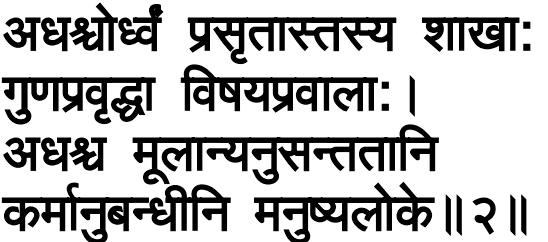

Of that very Tree of the World here is another qualification: *Yasya*, that Tree of the World of which; *chandāṁsi—chandas* being derived in the sense of covering (protecting)—, the Vedas in the form of rk, Yajus and Sāma; are the *parnāni*, leaves, as it were. As leaves serve as protectors of a tree, so the Vedas serve as the protectors of the world; for they reveal what are virtue and vice as also their causes and results.

*Yah*, he who; *veda*, knows; *tam*, that—the Tree of the World along with its root, as has been explained; *sah*, he; is a *vedavit*, knower of the Vedas, that is versed in the meaning of the Vedas.

Since, apart from this Tree of the World along with its root, not even an iota of any other thing remains to be known, therefore he who knows the purport of the Vedas is omniscient. In this way the Bhagavān eulogizes the knowledge of the Tree together with its root.

An imagery of the other parts of that very Tree of the World is being presented:

2. The branches of that (Tree), extending downwards and upwards, are strengthened by the qualities and have sense-objects as their shoots. And the roots, which are followed by actions, spread downwards in the human world [\(156\)](#page--1-0).

*Śākhāh*, the branches, as it were; *tasya*, of that Tree; *prasrtāh*, extending; *adhah*, downwards, from the human beings to the immobile (trees etc.); *ca*, and; *ūrdhvam*, upwards, up to Brahmā beginning from the Creator of the Cosmos to Dharma (Death), [\(157\)](#page--1-1) which, 'in accordance with their work and in conformity with their knowledge' (Ka. 2.2.7), are the results of knowledge and actions; are *guna-pravrddhāh*, strengthened, made stout, by the qualities *sattva*, *rajas* and *tamas*, which are their materials; and *visaya-pravālāh*,