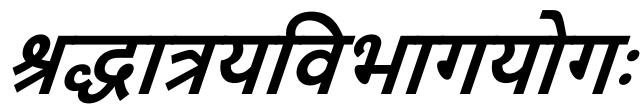

## *CHAPTER 17 THE THREE KINDS OF FAITH*

Finding an occasion for a question from the Bhagavān's statement, 'Therefore, the scripture is your authority,'—

*Arjuna said:*

## ये शािविधमु सृ य यजते यािवता:। तेष िना तु का कृ ण सवमाहो रजतम:॥१॥

1. But, [\(178\)](#page--1-0) O Krishna, what is the state [\(179\)](#page--1-1) of those who, endued with faith, adore [\(180\)](#page--1-2) by ignoring the injunctions of the scriptures? Is it *sattva*, *rajas* or *tamas*?

*Tu*, but; O Krishna, *kā*, what; is the *nisṭhā*, state; *tesām*, of those —whosoever they may be; *ye*, who; being *anvitāh*, endued; *śraddhayā*, with faith, with the idea that there is something hereafter; *yajante*, adore gods and others; *utsrjya*, by ignoring, setting aside; *śāstra-vidhim*, the injunctions of the scriptures, the injunctions of the Vedas and the Smrtis? Is the state of those who are such *sattvam*, *sattva*; *āho*, or; *rajah*, *rajas*; or *tamah*, *tamas*? This is what is meant: Does the adoration of gods and others that they undertake come under the category of *sattva* or *rajas* or *tamas*?

By 'those who, endued with faith, adore by ignoring the injunctions of the scriptures' are here meant those who, not finding any injunction which can be characterized as 'enjoined by the Vedas' 'or enjoined by the Smrtis', worship gods and others by merely