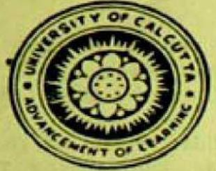

# YOGA PHILOSOPHY

### OF PATANJALI

CONTAINING HIS YOGA APHORISMS WITH COMMENTARY OF VYASA IN ORIGINAL SANSKRIT, AND ANNOTATIONS THEREON WITH COPIOUS HINTS ON THE PRACTICE OF YOGA

by

## Samkhya-Yogacharya SWĀMI HARIHARĀNANDA ĀRANYA (Founder of the Kapila Monastery)

#### RENDERED INTO ENGLISH BY

#### P. N. MUKERJI, C.B.E., R.B., M.A.

A disciple of the Kapila Monastery, and author of 'Sãmkhya O Yoga-Parichaya O Sãdhanã'

#### FOREWORD BY

SWAMI DHARMAMEGHA ARANYA

(Head of the Kapila Monastery)

UNIVERSITY OF CALCUTTA

1963