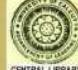

## ON CONCENTRATION

भाष्यम् - भ्रथ लब्धस्थितिकस्य चेतसः किंख्या किंविषया वा समापत्ति-रिति ? > तदुर्घ्यते मानवं - http://www.bloggendand.com/aread/mi

चौणवत्त्वर भिजातम्येव मणेय होत्वयहणयाद्योषु तत्स्यतदश्मनता मुमा-पत्ति: 11 82 11 17 alimit sant 11 140

चीणवत्तेरिति प्रत्यस्तमितपन्ययस्येत्यथः। अभिजातस्येव मणिरिति दृष्टान्तो-पादानम । यथा स्फटिक उपाययमेदात्त्वस्त्रपोपरक्ष उपाय्ययस्य कार्याय निर्मासते, तथा याह्यालस्वनोपरक्षः चित्तं याद्यसमापद्यं याह्यस्वरूपाकारिण निर्मासते, भूतसुन्द्रयोपरकतं भूतसुच्यसमापद्यं भूतसूच्यासासं भवति, तथा स्थूला-लब्बनोपरक्त स्युलरूपसमापद्यं स्थलरूपाभासं भवति, तथा विश्वभेदोपरता विश्वभेद्रसमापत्र' विश्वरूपाभासं भवति । तथा यहणेष्ठवपि द्रन्द्र्यम् । यहणालस्वनोपरतां ग्रहणसमापन्न ग्रहणस्वरूपाकारिण निर्मासते । तथा ग्रहोट-पुरुषालम्बनोपरतां ग्रहीत्युरुषसमापद्र' यद्योत्वपुरुषस्वरूपाकारिण निर्मासते । तथा मुक्तपुर्वालब्बनोपरक्षः मुक्तपुरुषसमापद्वं सुक्तपुरुषस्वरूपाकारिण निर्मासत । तदेवमभिजातमणिकरणस्य चेतसो याहौद्य हण्याद्ये पुरुषीन्द्रियभूतिषु या तत्रत्यतद्वनता तेषु स्थितस्य तटाकारापत्तिः सा समापत्तिरित्युच्यते बाहरु ॥ भारत

What the nature of engrossment of a stabilised (1) mind is and in what objects it is engrossed are being described. In and the de allering and

Bertal only cola a lover

ni benebidnd at

11 3 3 1 1 1

When The Fluctuations Of The Mind Are Weakened The Mind Appears To Take On The Features Of The Object Fixed On-Whether It Be The Cogniser, The Instrument Of Cognition Or The Object Cognised-As Does A Transparent Jewel, And This Identification Is Called Samapatti Or Engrossment (2). 41.

'Weakened fluctuation' refers to the state of the mind when all modifications but one disappear therefrom. The case of a precious (flawless) gem has been taken as an example. As a crystal being influenced by the colour of an article adjacent to it appears to be tinged by it, so the mind resting on a subject, appears to