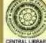

## **U4 yoga philosophy of pataSjali**

mind, so there cannot be any concentration on that nor any perceptual knowledge of it\* It is known by concepts with the help of words and so it can be a subject for Savichara Samftdhi.

## *M w* **n**

—*ii*rfrr^vjrefm^rr^rcq ^irT^rs, qraftara ^PRf^rran, ai^FHT^ficrfk t **fitTTt^fn: TOttfa falpITlTT ftw, f^rwioiwTiuifw'** fafi?:, *m* \*3^1 ? *mm,* tot qTirf=i5TO *m* Tj^tfr *m* ^fri: fsrdh\*nr ^opssrrerqji w\* 11

## **Subtility Pertaining To Objects Culminates in A'Lipga (1) Or The UnmanifcSt, 45.**

The subtle form (2) of Ksiti-elcmcnt is the smell\* Tanmaira : of Ap-elcment is the taste-Tanmiitra, of Tejaselemcnt is the light-Tanmatraj of Vayu-element is the touch-"!! anmatra, of Akasa-element is the sound-Tanmatra. The subtler form or constituent of Tanmatra is Ahamkara and the still subtler form of the Ego is the first manifested Mahan or Mahat-tattva. The subtler form of the first manifested or Mahan is the unmanifest or Prakrii. There is nothing subtler than the unmanifest. If it is said that Purusa is subtler than that, the reply is \*'That is; true\* but the subtility of Purusa is not of the same kind as that oT the unmanifest Prakrti'\* Purusa is not the material cause of the first manifest ob+ecl *viz\** Mahat, but its efficient cause (3). That is why it has been said that subtility has reached its limit in Pradhana or Prakrti (which is the state of equilibrium of the three Gunas or constituent principles).