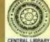

## **Book** II On Practice

& ,

TOlf^rrf^TT\*si *£Ut\* gm: ^ifVrirrf^rt^jTT—

?fcr:^TWFWtRf^^T5ni?r %\*ircftTT: n \* n

**3fr\*t: ftrtTrfH 1 ^rrf<\*iR^f^qwiR^rfaat qr\*pjfc^' f%7TH«r^»Ta(TWt5ra^iTlftiiqf«f^** *\* **Tpmufetrfaennn** 5Tq:, »Tt^sqTOrtq^ 3T I TOTtjfa^TST R^fifi?THFTf qWjmtj"T **FTrtfisfWsqmft II ? Jl**

The yoga attained by a yogin with engrossed mind has been stated. This Sutra starts to indicate how a devotee with a restless mind can also attain yoga,

## **Tapas {Austerity), Svidhyiya (Repetition Of Sacred Mantras Or Study OF Sacred Literature) And livara Pranidhina (Complete Surrender To God) Are Kriya Yoga (Yoga In The Form Of Action). I.**

A man without austerity cannot attain perfection in Yoga. The impurities or the dross in the mind arising out of the shares of worldly objects which are inimical to Yoga, are coloured by the Vasanas of actions and afflictions from beginninglcss time, and they cannot be got rid of or dissipated without practice of austerities. That is why austerities have to be practised. It is considered by Acharyas or sages austerity that \yhich is purifactory and wrhich removes obstruction to cofltemplatioiij is to be practised by yogins.

Svadhyaya—Repetition of a sacred Mantra *t.g.* the sacred syllabic OM, or study of literature relating to Moksa or freedom From bondage.