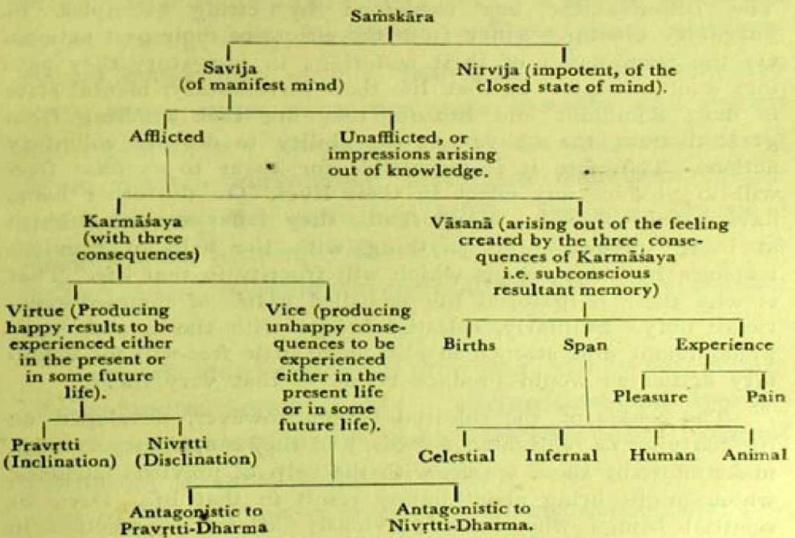

## ON PRACTICE

Samskaras based on realised knowledge or insight are known as neither black nor white.

Karmasaya brings about three consequences or results viz. birth, span of life and experience (of pleasure or pain) in that life. In other words, the Samskara which brings about such result is Karmasaya. When the consequences take place, the Samskara based on the feeling experienced thereby is called Vasana or subconscious latency. Vasana does not of itself produce any consequence or result, but for any Karmasaya to produce result the appropriate Vasana is necessary. Karmasaya is like a seed, Vasana is like a field, the birth or embodiment is like a tree and experience (pleasure or pain) is like its fruits. For the convenience of the reader, Samskara is being shown below in a tabular form :-

## How to effect destruction of latent impressions

1. By Nivrtti-dharma (the spirit of renunciation) Pravrtti-Dharma (spirit of inclination to worldliness) is weakened.